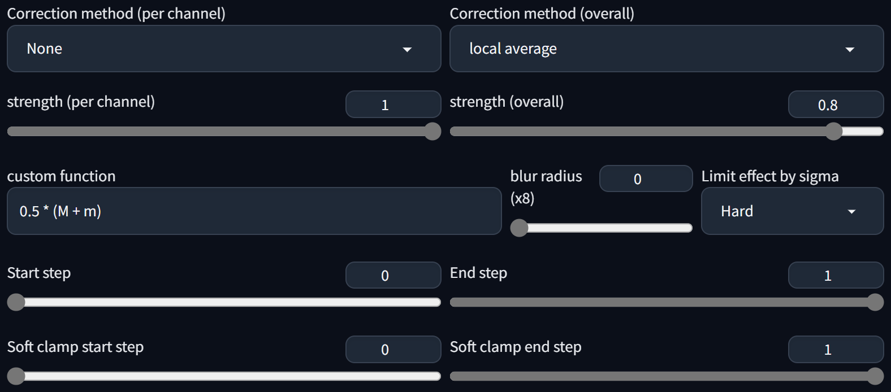

# Latent Drift Correction #
### extension for Forge webui for Stable Diffusion ###

---
## Install ##
Go to the **Extensions** tab, then **Install from URL**, use the URL for this repository.

--- 

---
## Basic usage ##
Pick methods.

---
## Advanced / Details ##
Delaying the start can be beneficial, as can early ending.
This sort of correction has a tendency to prevent extremes of lighting.
custom functions:
* M: mean
* m: median
* q(n): quantile. 0.5 is same as median; using high values will darken the image appropriately for sunsets, etc.
* rM(n, m): mean of range, rM(0, 0.5) gives mean of lowest 50%
* c: channel index, will be 0, 1, 2 or 3. Example uses: q([0.9, 0.5, 0.5, 0.7][c]); [m, 0.0, 0.0, 0.1][c]

---
#### 06/06/2024 ####
larger update:
* added local average to overall, can use as a local contrast adjustment, adjustable blur radius
* added strength sliders for per channel and overall (removes previously hidden multipliers, defaults match those previous values)
* minor UI reshuffle

#### 05/11/2024 ####
fixed bug with centered mean and topK of 0.5. (0.5-0.5)=0, who knew?

#### 25/04/2024 ####
added saving/loading of custom functions

---
## License ##
Public domain. Unlicense. Free to a good home.
All terrible code is my own. Use at your own risk, read the code.

---
## Credits ##
General idea from (Birch Labs)[https://birchlabs.co.uk/machine-learning#combating-mean-drift-in-cfg] but this is after CFG

SoftClamp method by (Timothy Alexis Vass)[https://huggingface.co/blog/TimothyAlexisVass/explaining-the-sdxl-latent-space]

---
